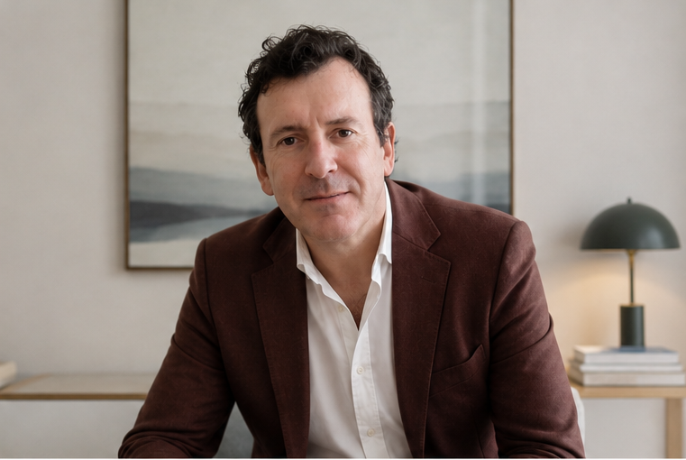

::: {layout-ncol="2"}
{width="20%"}

I am a political scientist working in the areas of Decentralization, and Local Government, and Public Policy. I am an Assistant Professor at the Universidade de Aveiro, a member of the research unit on Governance, Competitiveness, and Public Policies (GOVCOPP), and Director of the Master in Public Administration annd Public Policy. 

[ORCID](https://orcid.org/0000-0003-2294-1488) 

On this site I keep a list of my publications, presentations, and my CV.

[IDEAGOV member](https://www.ideagov.eu/people)
