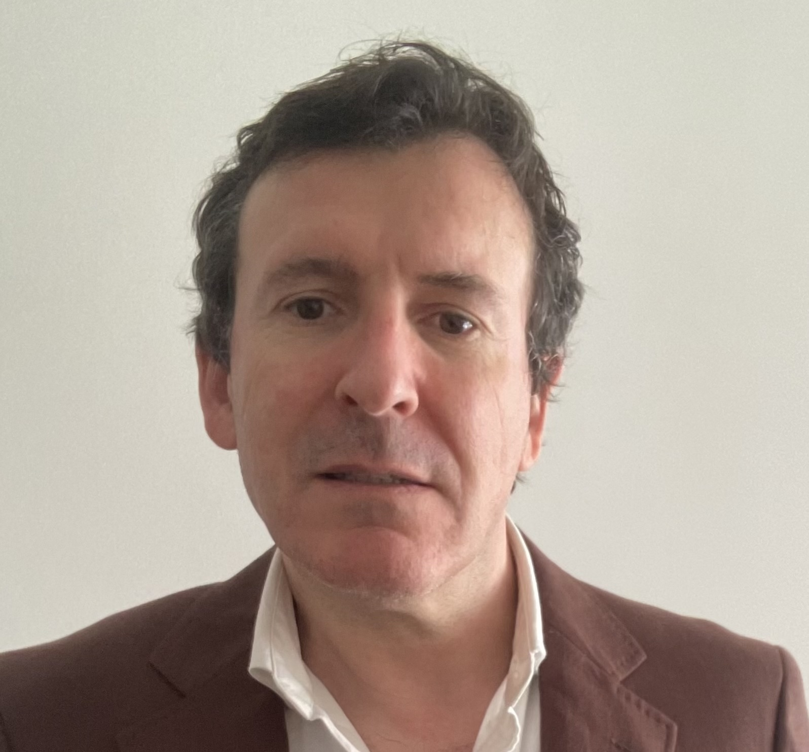

::: {layout-ncol="2"}
{width="20%"}

I’m an environmental technologist, working at the US Geological Survey on improving how we deliver water data to the public. In prior roles, I split my time between predictive modeling (to monitor forest carbon sequestration across New York State, track the development of early-successional forests, and more) and visualization (including using game engines as a GIS and making it easier to make reproducible VR environments for research). By training I’m either an ecologist (specializing in landscape and translational ecology) or environmental scientist; professionally, I’ve worked as a data analyst, software engineer, and chicken farmer.

On this site I keep a list of my publications, presentations, and my CV, as well as a technical blog.

:::

[ORCID](https://orcid.org/0000-0003-2294-1488) 

[IDEAGOV member](https://www.ideagov.eu/people)
